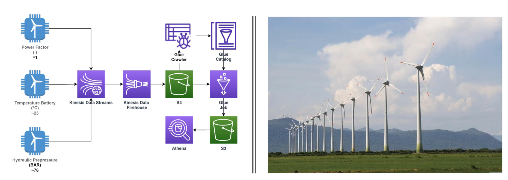

# projeto_engdados02
>Projeto2 - Processing streaming data generated by sensors from a wind farm. Using Python, AWS S3, AWS Kinesis Stream, AWS Firehose, AWS Glue, AWS Athena, and SQL.

## Goal:

This system aims to process sensor data from a wind farm. The data-producing applications were developed in Python on Google Colab. Each of the applications produces different data every 10 seconds. We will use Kinesis Data Stream to receive the data stream.

After that, we will use Kinesis Firehose to deliver the data, where the source is the stream and the destination is a bucket created in S3.

We will use the Glue Catalog to create a database based on the data stored in S3 (in JSON format) and a Crawler to automatically discover the data structure.

Next, we will use a Glue Job to save our data in a new bucket in Parquet format. No transformations will be performed on the data.

With the data in Parquet format and in a new bucket, we will use the Athena tool to perform SQL queries.

## Resolution:

Three Python programs were created using Google Colab to represent the data-producing applications. After that, the entire data engineering process was carried out on AWS.
